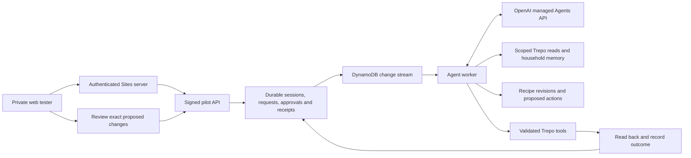

# Thyme agent pilot

Status: private pilot implemented and deployed; final qualification report records verified coverage. Approved by Matt Taylor in the Trepo app conversation on 2026-10-01. This is a private pilot, not an all-customer rollout.

## Outcome

A useful, persistent kitchen agent with live household data, stable recipe revisions, explicit and auditable changes, and a private phone-friendly chat tester. The tester uses a service contract suitable for a later iOS adapter; the native app has not been switched. Existing iOS endpoints remain compatible and unchanged during this pilot.

## Architecture

The server determines identity; neither the browser nor model can choose a household. The private site starts with Matt only. Resolve membership afresh before operations. Bind sessions, approvals, recipes and operation receipts to both actor and household. Keep the provider key and all Trepo credentials server-side. Use a pinned snapshot of deployed tool implementations, not a copy of the dirty working tree.

## Decisions and failure handling

- Managed Agents API, no coding environment. Start with GPT-6.1 Sol and benchmark Astra and Luna on the same scenarios. Do not infer quality from model names alone.
- Save a request before dispatch, use an idempotency key at every boundary, and reuse provider sessions across turns. Queue redelivery must resume rather than repeat changes.
- Function calls have durable receipts. Read operations may retry. An uncertain write becomes a reconciliation task, never a blind replay. Success requires an actual result and verification.
- Pilot changes to real Trepo data require an explicit review of the concrete action. Model text cannot approve a change. Approval is scoped, expiring, and checked against the current data revision.
- Recipes are durable structured objects. An edit changes named fields against an expected revision. Preserve unrelated ingredients, portions and instructions; reject stale edits. Drafting a recipe does not change kitchen stock.
- Live inventory and dietary constraints take precedence over soft memory. Treat imported content as data, not executable instructions. Do not invent quantities, expiry safety, or purchases.
- Bound tool rounds, wall time, output size and per-account concurrency. Surface timeouts and recoverable failures honestly; closing the browser does not cancel work.
- Fail closed if identity, membership, tool validation or storage is unavailable. Keep failure messages useful without exposing credentials or internal errors.
- No purchase, payment, shipping or unapproved broad rollout is in scope. The pilot may plan shopping and update approved list items.

## Engineering review and tests

Architecture: isolate the new runtime; reuse domain tools through one gateway; persist state before external effects. Avoid a second maintained copy of the legacy conversation harness.

Code quality: small modules for provider, storage, authorization, tool gateway, recipe revisions and request runner; injected adapters for deterministic tests. Client rendering treats all model and recipe text as text.

Tests: schema and authorization failures; cross-account access; ambiguous names; empty and large kitchens; unknown quantities; current dietary restrictions; recipe follow-up drift; stale recipe revisions; failed and partially completed tools; repeated approvals; duplicate queue deliveries; browser disconnect; provider timeouts; concurrent messages; pagination; old response adapters. Test real managed tool calls and recovery using synthetic data before real household read-only canaries.

Performance: capture first acknowledgement, full answer, tool round count, input/output tokens and cost by scenario. Load only relevant tools/data; do not preload every full recipe. UI acknowledges immediately and displays actual progress. Benchmark fast-model routing before enabling it.

Release gate: passing unit/integration tests, live provider qualification, private-site authentication checks, desktop/mobile browser verification, reproducible artifact hashes and rollback instructions. Record what was actually tested separately from intended coverage. No claim of all-environment/iOS QA unless those checks are run.

## Brand and provenance

Company brain read 2026-10-01: `brand/trepo-brand-guidelines`, `brand/trepo-app-design-system`, historical Thyme review evidence. Use the app-specific warm cream, teal, yellow and outlined components for this app companion. Preserve the original logo asset. App styling is not a company-wide amendment.

## Prior release work

The earlier reliability patch has a separate checkpoint at `/Users/MattTaylor/Documents/Codex/2026-10-01/thyme-quality-release/RELEASE-CHECKPOINT.md`. Its 1128 passing tests do not establish this pilot's correctness. Preserve that work and do not deploy unrelated dirty source.
